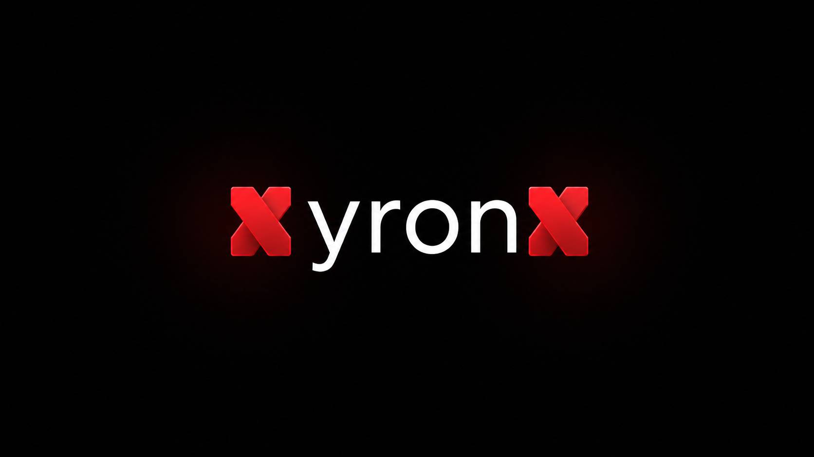
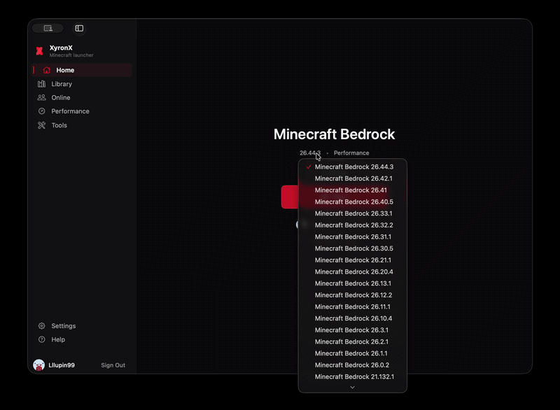
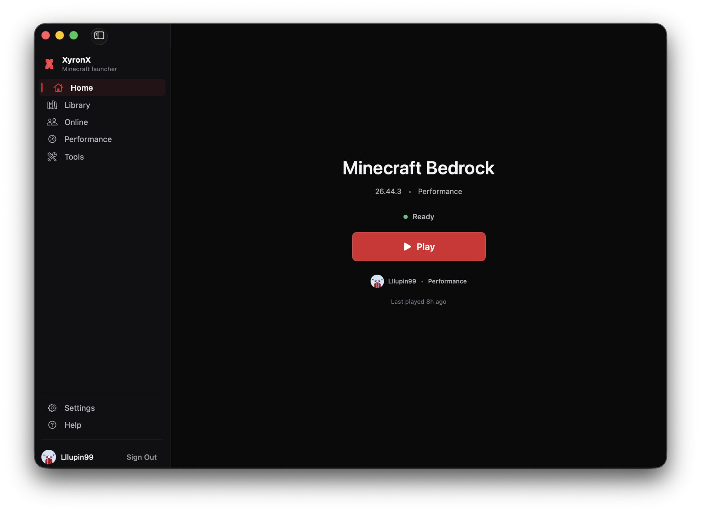
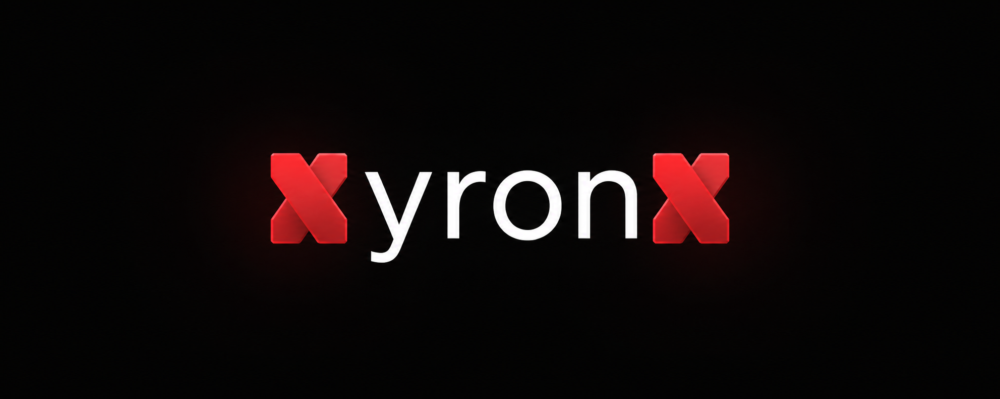
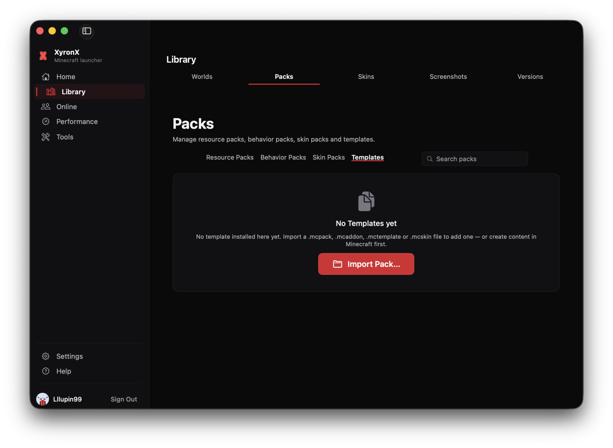
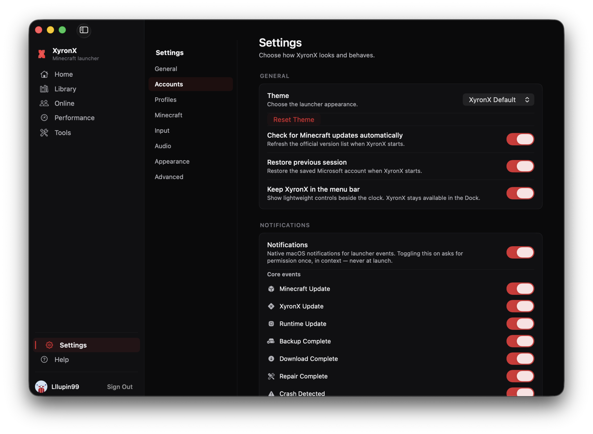

# XyronX

### A focused Minecraft Bedrock client experience for macOS.

 

**Built with**

XyronX is an independent macOS project providing a focused Minecraft Bedrock client experience around performance, clean design, and playing together. It is for people who want a focused launcher and management experience for Minecraft Bedrock Edition for Windows on Mac. The project is built by one independent developer and continues to evolve, so features and compatibility can change between releases.

XyronX is not affiliated with, sponsored by, or endorsed by Microsoft or Mojang Studios.

## Table of contents

- [Current status](#current-status)
- [Screenshots & demo](#screenshots--demo)
- [What XyronX is building](#what-xyronx-is-building)
- [Client scope](#client-scope)
- [Getting started](#getting-started)
- [Links](#links)
- [FAQ & disclaimer](#faq--disclaimer)
- [Contributing](#contributing)
- [License](#license)

## Current status

XyronX has a public client available through the official [GitHub Releases](https://github.com/lllupin99/XyronX/releases) page. The project is still actively developed, so features, compatibility, and release contents can change.

The project does not distribute Minecraft binaries, Store packages, installers, or modified copies of Minecraft here. XyronX does not bypass ownership checks, licensing, security controls, or Microsoft Store protections. A legitimate Microsoft account that owns Minecraft is required for the supported game flow.

## Screenshots & demo

### Demo

  

### Home

  

### Version selection

  

### Library

  

### Settings

## What XyronX is building

These are the three product principles described on the project website:

- **Performance** — a responsive experience from opening the client to getting into a world.
- **Clean by design** — minimal UI, clear hierarchy, and panels with a reason to exist.
- **Made to evolve** — a visual system that can grow with future modules, settings, and customization.

## Client scope

The current wiki documents XyronX as a native macOS launcher for Minecraft Bedrock Edition for Windows. Its documented launcher scope includes:

- **Account & setup** — Microsoft account sign-in through the browser using OAuth and PKCE, ownership and readiness checks, and managed WineGDK runtime setup with DXMT Direct3D 11 to Metal translation.
- **Play** — Minecraft version management, profiles, graphics settings, and performance profiles.
- **Worlds & content** — world discovery, backups, duplication, restore, safe import workflows, resource packs, behavior packs, skin packs, world templates, skins, and screenshots.
- **Online & social** — Bedrock server status checks, Xbox friends, read-only achievements, and diagnostics for Realms and Marketplace prerequisites.
- **Maintenance** — Doctor, Fix, Recovery, Storage, Logs, Health, and structured bug-report workflows.
- **Input & audio** — controller support through macOS GameController and audio routing through CoreAudio.

Some areas are diagnostic-only, experimental, or dependent on external Microsoft services. Consult the [Wiki](docs/XYRONX-WIKI.md) and [feature status matrix](docs/FEATURE-STATUS.md) for the current implementation state and known limitations.

## Getting started

Download the public client from [GitHub Releases](https://github.com/lllupin99/XyronX/releases).

1. Open the Releases page and choose the current client release for macOS.
2. Install or launch XyronX according to the release notes.
3. Follow the first-run onboarding.
4. Sign in with the Microsoft account that owns Minecraft Bedrock Edition for Windows.

For the current development status and release infrastructure, see [Release Infrastructure](RELEASE_INFRASTRUCTURE.md). XyronX uses verified runtime manifests and checksums; it does not guess binary download URLs.

**Requirements:** macOS 14.0 (Sonoma) or later. Apple Silicon is the primary target; Intel Macs use conservative defaults. See the [Wiki FAQ](docs/XYRONX-WIKI.md#faq) for platform details.

⭐ If you find XyronX useful, consider [starring the repository](https://github.com/lllupin99/XyronX).

## Links

| Resource | Link |
| --- | --- |
| Website | [XyronX project site](https://lllupin99.github.io/website/) |
| Wiki | [XyronX Wiki & Help](docs/XYRONX-WIKI.md) |
| Feature status | [Feature Status Matrix](docs/FEATURE-STATUS.md) |
| Discord | [Join the XyronX Discord](https://discord.com/invite/h5tkH3zsyS) |
| Releases | [GitHub Releases](https://github.com/lllupin99/XyronX/releases) |
| Issues | [Report a bug or request a feature](https://github.com/lllupin99/XyronX/issues) |
| Project information | [Community and project information](McMacClient/Resources/project-info.json) |

## FAQ & disclaimer

The [Wiki FAQ](docs/XYRONX-WIKI.md#faq) covers authentication, ownership, Bedrock versus Java, WineGDK, DXMT, worlds, servers, Realms, performance, storage, and recovery in more detail.

XyronX is an independent fan project. It is not affiliated with Microsoft or Mojang Studios, and no Minecraft game files are distributed in this repository or on the project website. Users must obtain and own Minecraft through legitimate channels and follow the applicable terms and licenses.

## Contributing

The client and supporting systems are public and still under active development. Use GitHub Issues for reproducible bugs and feature requests, and use the [Discord](https://discord.com/invite/h5tkH3zsyS) for discussion, feedback, and development updates.

Before contributing, check the [Wiki](docs/XYRONX-WIKI.md), [feature status matrix](docs/FEATURE-STATUS.md), and existing issues for the current state of the project.

## License

This repository does not currently contain a `LICENSE` file. No open-source license is asserted here. Treat the code and assets as all rights reserved unless the repository owner adds explicit licensing terms.
